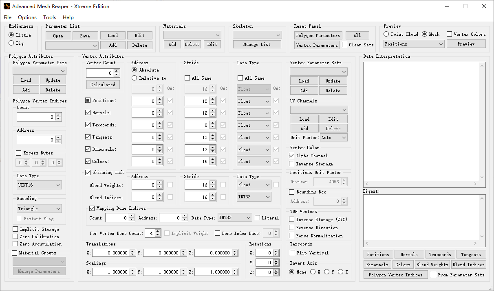

# Introduction
Advanced Mesh Reaper - Xtreme Edition, abbreviated AXE, is a helper tool for interactive model researching/extraction. It's designed to support as many vertex attributes as possible. Apart from positions, normals and texcoords, AXE supports also tangents, binormals, vertex colors, blend indices and blend weights. You can use the "Auto Bone Generation" utility to generate a skeleton from the skinning info, or import from an existing skeleton dump.

AXE also attempts to provide more flexibility so as to deal with different data structures. A mesh object can be described with multiple polygon and vertex parameter sets which provides a possibility to handle and validate variable-length data structure, or simply to merge a set of sub-meshes into a single object.

# Main Features
1. Ability to specify individual data source files for polygon and vertex attributes, or to use a single source for all channels;
2. Support for material assignment and management;
3. Support for assigning multiple materials to different polygon sets of a single mesh;
4. Flexible mesh constructing workflows based on parameter set system;
5. Support for all kind of vertex attributes including positions, texture coordinates, TBN vectors, vertex colors and skinning info;
6. Ability to handle position bounding box to retain the in-game scaling;
7. Support for multiple UV channels without limit on amount;
8. Support for applying textures on any specified UV channel;
9. Ability to merge sub-meshes into a single object or to split a mesh group into physically detached sub-meshes;
10. Support for mesh transformation including translation, rotation, scaling and axis inversion;
11. Ability to automatically generate a set of bone nodes from existing skinning info, and provides tools for editing and constructing a usable skeleton based on the result;
12. Data interpretation and statistics analysis for polygon and vertex attributes;
13. Support for saving/loading all params to/from the parameter list container format;
14. Helper tool to reorganize data referenced by indices;
15. Visualization for positions, texcoords, TBN vectors, vertex colors and skeleton.

# System Requirement
Windows XP or higher. Microsoft Visual C++ 2015 Redistributable (x86) or above is required for runtime.
